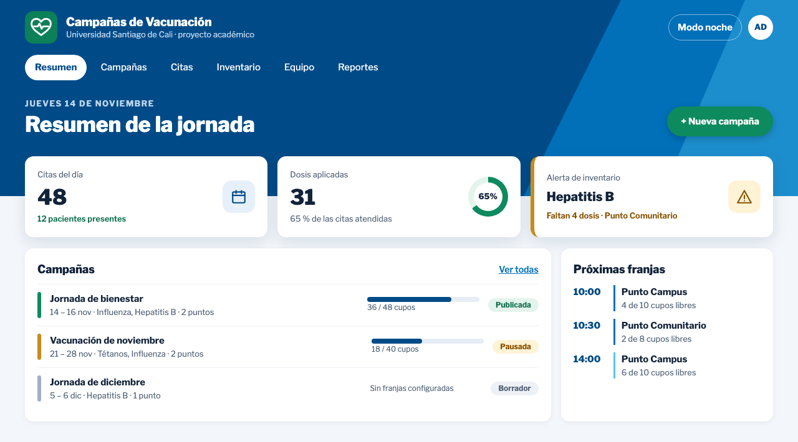
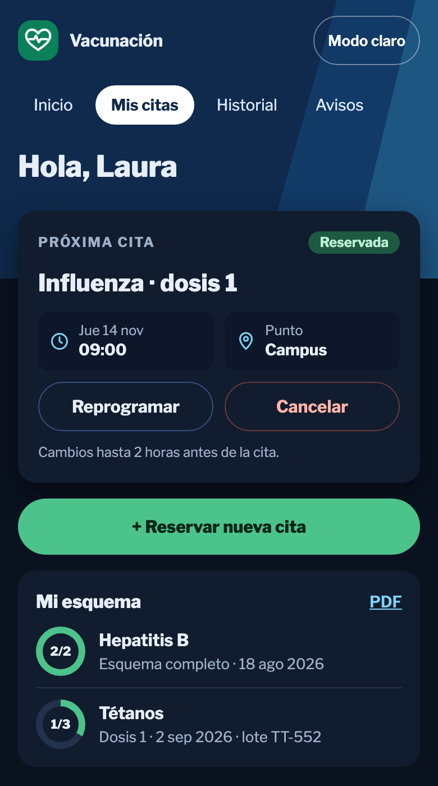

# vacunacion-app
Sistema de Gestión de Campañas de Vacunación — Mini-Proyecto I, Lenguajes de Programación 2026B. Flask + SQLite, arquitectura MVC.

## Diseño de la interfaz

Propuesta elegida por el equipo: **banda de identidad** con el azul marino de la
Universidad Santiago de Cali, verde para las acciones principales y tema claro y
noche. Las imágenes son de la maqueta (datos ficticios); las pantallas reales se
construyen módulo a módulo.

<p>
  
  
</p>

## Preparar el entorno

Requiere Python 3.10 o posterior.

```bash
python -m venv .venv
# Windows: .venv\\Scripts\\activate
# macOS/Linux: source .venv/bin/activate
pip install -r requirements.txt
python run.py
```

Al crear la aplicación se inicializa el esquema en `instance/vacunacion.db`.
La carpeta `instance/` contiene datos locales y el archivo de base está
ignorado por Git; cada integrante genera su propia base al ejecutar la app.
También se puede crear explícitamente con `flask --app run init-db`.

Para guardar la base en otra ruta, define `DATABASE_PATH`. En producción,
define además `SECRET_KEY` con un valor secreto propio.

## Esquema SQLite actual

El esquema se mantiene en `app/schema.sql` y se ejecuta con el módulo estándar
`sqlite3` (no se usa ORM). Contiene:

- `usuarios`: cuentas de administradores, vacunadores y pacientes; nombre,
  tipo y número de documento (únicos juntos), correo único, contraseña con hash
  y rol.
- `pacientes`: fecha de nacimiento, contacto y declaración del responsable
  (16–17 años); se enlaza con su cuenta en `usuarios`.
- `tokens_cuenta`: enlaces de recuperación e invitación (solo el hash; vencen
  en 30 minutos y se usan una vez).
- `vacunador_punto`: puntos asignados a cada vacunador.
- `auditoria`: quién cambió qué y cuándo, sin contraseñas.
- `vacunas`: fabricante, lote, vencimiento y dosis requeridas.
- `puntos_vacunacion`: ubicación, horario y capacidad diaria.
- `inventarios_biologicos`: existencias por combinación de punto y vacuna.
- `citas`: paciente, vacuna, punto, fecha, hora y estado.
- `dosis_aplicadas`: historial de dosis administradas.

Inventario tiene una restricción única por punto y vacuna. Las citas y dosis
se eliminan si se elimina el paciente; los puntos y vacunas referenciados por
citas o dosis quedan protegidos contra borrado para conservar el historial.
El inventario sí se elimina junto con su punto o vacuna. Las claves foráneas
se activan en cada conexión SQLite en `app/db.py`.

## Cuentas

- Los pacientes crean su cuenta en «Crear cuenta» (desde los 16 años).
- El primer administrador se crea desde la consola; pide los datos y la
  contraseña, que no se guarda en el repositorio:

```bash
flask --app run crear-admin
```

- El administrador invita a los vacunadores desde «Usuarios» y les asigna
  puntos. El vacunador recibe un enlace para crear su contraseña. Mientras el
  correo no esté configurado (módulo M06), `python run.py` muestra el enlace
  en la consola.

## Acceso a SQLite desde Flask

Usa `get_db()` para obtener la conexión de la petición actual. Los resultados
se pueden leer por nombre de columna (`fila["nombre_completo"]`). Flask cierra
la conexión al terminar el contexto de la petición. Al añadir modelos,
mantenlos sobre esta conexión y usa consultas parametrizadas (`?`) para
valores de usuario.

## Pruebas

Las pruebas usan pytest y una base temporal (nunca `instance/vacunacion.db`).

```bash
pip install -r requirements-dev.txt
pytest -q
```

Cuando cambie `app/schema.sql`, borren su `instance/vacunacion.db` local y
vuelvan a ejecutar la app para regenerarla (los datos son ficticios).
